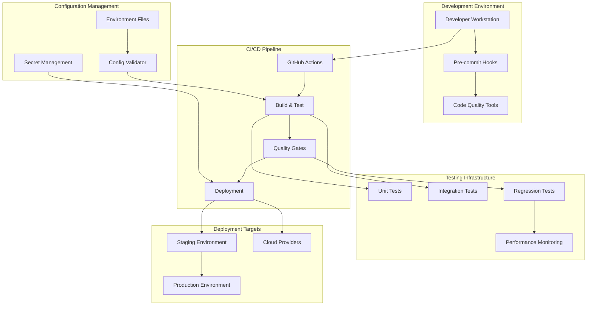
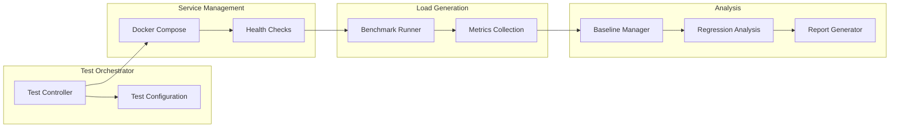

# Design Document

## Overview

This design addresses the critical infrastructure gaps in the Finance Ingestion Benchmark project by implementing a modern, cloud-ready CI/CD pipeline, centralized configuration management system, and comprehensive code quality enforcement. The solution eliminates hardcoded configurations, establishes reliable regression testing, and provides robust development workflows that support the project's high-performance requirements.

The design follows industry best practices for monorepo management, containerized deployments, and multi-language development environments while maintaining the project's performance-critical nature.

## Architecture

### High-Level Architecture



### Component Architecture

The system consists of four main architectural layers:

1. **Development Layer**: Local development tools and pre-commit validation
2. **CI/CD Layer**: Automated pipeline orchestration and quality gates
3. **Configuration Layer**: Centralized configuration management and validation
4. **Deployment Layer**: Multi-environment deployment with health monitoring

## Components and Interfaces

### 1. CI/CD Pipeline System

#### GitHub Actions Workflows

**Primary Workflows:**
- `ci.yml`: Main CI pipeline for code validation and testing
- `cd.yml`: Deployment pipeline with environment-specific configurations
- `regression.yml`: Performance regression testing (redesigned)
- `quality.yml`: Code quality enforcement and reporting

**Workflow Structure:**
```yaml
# Simplified workflow interface
name: CI Pipeline
on: [push, pull_request]
jobs:
  validate:
    - Code quality checks
    - Unit tests
    - Integration tests
  
  regression:
    needs: validate
    if: github.event_name == 'pull_request'
    - Performance regression tests
    - Baseline comparison
  
  deploy:
    needs: [validate, regression]
    if: github.ref == 'refs/heads/main'
    - Staging deployment
    - Health checks
    - Production deployment (manual approval)
```

#### Reusable Workflow Components

**Composite Actions:**
- `setup-node-python/action.yml`: Multi-language environment setup
- `quality-check/action.yml`: Unified code quality validation
- `deploy-service/action.yml`: Service deployment with health checks
- `regression-test/action.yml`: Performance testing orchestration

### 2. Configuration Management System

#### Hierarchical Configuration Structure

```
configs/
├── base/                    # Base configuration templates
│   ├── app.base.env        # Application-level defaults
│   ├── services.base.env   # Service-level defaults
│   └── infrastructure.base.env # Infrastructure defaults
├── environments/           # Environment-specific overrides
│   ├── development.env     # Development configuration
│   ├── staging.env         # Staging configuration
│   └── production.env      # Production configuration
└── local/                  # Local development overrides
    └── .env.local          # Developer-specific settings
```

#### Configuration Schema

**Python Configuration (Pydantic Settings):**
```python
class DatabaseConfig(BaseSettings):
    host: str = "localhost"
    port: int = 5432
    database: str = "finance_benchmark"
    username: str
    password: SecretStr
    
    class Config:
        env_prefix = "DB_"
        env_file = ".env"

class ApplicationConfig(BaseSettings):
    port: int = 3000
    log_level: str = "INFO"
    enable_metrics: bool = True
    database: DatabaseConfig = DatabaseConfig()
```

**Node.js Configuration (Joi Validation):**
```javascript
const configSchema = Joi.object({
  port: Joi.number().default(3000),
  logLevel: Joi.string().valid('debug', 'info', 'warn', 'error').default('info'),
  database: Joi.object({
    host: Joi.string().required(),
    port: Joi.number().default(5432),
    database: Joi.string().required(),
    username: Joi.string().required(),
    password: Joi.string().required()
  }).required()
})
```

#### Environment Validator

**Pre-startup Validation Interface:**
```bash
# CLI interface for configuration validation
npm run validate-config [--env=development|staging|production]
python -m finance_ingestion.cli validate-config [--env=development|staging|production]

# Output format
✅ Configuration Valid
📋 Loaded Configuration Summary:
   - Environment: development
   - Database: localhost:5432/finance_benchmark
   - Redis: localhost:6379
   - Log Level: INFO
   
⚠️  Default Values Detected:
   - Using default admin password (change for production)
   - Using default Redis configuration
```

### 3. Code Quality System

#### Linting Configuration

**Python (Ruff + Black + MyPy):**
```toml
[tool.ruff]
target-version = "py311"
select = [
    "E", "W",    # pycodestyle
    "F",         # pyflakes  
    "I",         # isort
    "B",         # flake8-bugbear
    "C4",        # flake8-comprehensions
    "UP",        # pyupgrade
    "N",         # pep8-naming
    "S",         # bandit security
    "T20",       # flake8-print
]
line-length = 100

[tool.black]
line-length = 100
target-version = ['py311']

[tool.mypy]
python_version = "3.11"
strict = true
warn_return_any = true
disallow_untyped_defs = true
```

**Node.js (ESLint + Prettier):**
```javascript
// .eslintrc.js - Using @eslint/js recommended
import js from '@eslint/js'
import globals from 'globals'

export default [
  js.configs.recommended,
  {
    languageOptions: {
      ecmaVersion: 2022,
      sourceType: 'module',
      globals: {
        ...globals.node,
        ...globals.jest
      }
    },
    rules: {
      'no-console': 'off',
      'prefer-const': 'error',
      'no-var': 'error',
      'no-unused-vars': ['error', { argsIgnorePattern: '^_' }]
    }
  }
]
```

#### Quality Commands Interface

**Unified Commands:**
```bash
# Check commands (CI-friendly, exit codes)
npm run quality:check        # Run all quality checks
npm run lint:check          # Linting only
npm run format:check        # Formatting only
npm run type:check          # Type checking only

# Fix commands (developer-friendly, auto-fix)
npm run quality:fix         # Fix all auto-fixable issues
npm run lint:fix           # Fix linting issues
npm run format:fix         # Fix formatting issues

# Individual language commands
npm run quality:python:check
npm run quality:python:fix
npm run quality:node:check  
npm run quality:node:fix
```

### 4. Regression Testing System (Redesigned)

#### Test Architecture

**Problems with Current Implementation:**
1. Hardcoded service ports and configurations
2. Complex application startup/shutdown logic
3. Unreliable baseline management
4. No clear test isolation

**New Design Approach:**


**Simplified Test Configuration:**
```json
{
  "test_scenarios": [
    {
      "name": "baseline_load",
      "duration_seconds": 60,
      "message_rate": 1000,
      "services": ["python-ingestion", "node-ingestion"]
    }
  ],
  "thresholds": {
    "latency_degradation_percent": 15,
    "throughput_degradation_percent": 10,
    "memory_increase_percent": 20
  },
  "baseline_strategy": "automatic"
}
```

#### Docker-based Service Management

**Test Environment Setup:**
```yaml
# docker-compose.test.yml
version: '3.8'
services:
  python-ingestion-test:
    build: ./apps/python-ingestion
    environment:
      - PORT=3001
      - LOG_LEVEL=ERROR
      - TEST_MODE=true
    depends_on:
      - redis-test
      - postgres-test
  
  node-ingestion-test:
    build: ./apps/node-ingestion  
    environment:
      - PORT=3002
      - LOG_LEVEL=error
      - NODE_ENV=test
    depends_on:
      - redis-test
      - postgres-test
```

## Data Models

### Configuration Schema

```typescript
interface EnvironmentConfig {
  environment: 'development' | 'staging' | 'production'
  services: {
    [serviceName: string]: ServiceConfig
  }
  infrastructure: InfrastructureConfig
  monitoring: MonitoringConfig
}

interface ServiceConfig {
  port: number
  logLevel: string
  enableMetrics: boolean
  database: DatabaseConfig
  redis: RedisConfig
}

interface DatabaseConfig {
  host: string
  port: number
  database: string
  username: string
  password: string
  ssl: boolean
}
```

### CI/CD Pipeline State

```typescript
interface PipelineExecution {
  id: string
  trigger: 'push' | 'pull_request' | 'schedule' | 'manual'
  branch: string
  commit: string
  stages: PipelineStage[]
  status: 'pending' | 'running' | 'success' | 'failure'
  startTime: Date
  endTime?: Date
}

interface PipelineStage {
  name: string
  status: 'pending' | 'running' | 'success' | 'failure' | 'skipped'
  jobs: PipelineJob[]
  artifacts: Artifact[]
}
```

### Regression Test Results

```typescript
interface RegressionTestResult {
  testId: string
  implementation: 'python' | 'nodejs'
  scenario: string
  timestamp: Date
  metrics: PerformanceMetrics
  baseline?: PerformanceMetrics
  regressions: RegressionDetection[]
  improvements: ImprovementDetection[]
  passed: boolean
}

interface PerformanceMetrics {
  latency: LatencyMetrics
  throughput: ThroughputMetrics
  resources: ResourceMetrics
  errors: ErrorMetrics
}
```

## Error Handling

### Configuration Validation Errors

**Error Categories:**
1. **Missing Required Variables**: Clear identification of missing environment variables
2. **Invalid Values**: Type validation and range checking with suggested corrections
3. **Dependency Conflicts**: Detection of incompatible configuration combinations
4. **Security Issues**: Identification of default/insecure values

**Error Response Format:**
```json
{
  "valid": false,
  "errors": [
    {
      "category": "missing_required",
      "variable": "DATABASE_PASSWORD",
      "message": "Database password is required",
      "suggestion": "Set DATABASE_PASSWORD environment variable"
    },
    {
      "category": "security_warning", 
      "variable": "ADMIN_PASSWORD",
      "message": "Using default admin password",
      "suggestion": "Change ADMIN_PASSWORD for production deployment"
    }
  ],
  "warnings": [
    {
      "variable": "LOG_LEVEL",
      "message": "Using default log level 'INFO'",
      "suggestion": "Consider 'ERROR' for production"
    }
  ]
}
```

### CI/CD Pipeline Error Handling

**Failure Recovery Strategies:**
1. **Automatic Retry**: Transient failures with exponential backoff
2. **Partial Failure Handling**: Continue pipeline with non-critical failures
3. **Rollback Mechanisms**: Automatic rollback on deployment failures
4. **Notification System**: Immediate alerts for critical failures

### Regression Test Error Handling

**Test Failure Categories:**
1. **Service Startup Failures**: Clear diagnostics for application startup issues
2. **Load Generation Failures**: Detailed error reporting for benchmark failures  
3. **Baseline Comparison Failures**: Graceful handling of missing or invalid baselines
4. **Infrastructure Failures**: Docker/database connectivity issues

## Testing Strategy

### Unit Testing

**Coverage Requirements:**
- Python: 90% code coverage with pytest
- Node.js: 90% code coverage with Jest
- Configuration validation: 100% coverage
- CI/CD utilities: 85% coverage

**Test Structure:**
```
tests/
├── unit/
│   ├── python/
│   │   ├── test_config_validation.py
│   │   ├── test_environment_loader.py
│   │   └── test_cli_commands.py
│   └── node/
│       ├── config-validation.test.js
│       ├── environment-loader.test.js
│       └── cli-commands.test.js
├── integration/
│   ├── test_ci_pipeline.py
│   ├── test_config_management.py
│   └── test_regression_runner.py
└── e2e/
    ├── test_full_pipeline.py
    └── test_deployment_workflow.py
```

### Integration Testing

**Test Scenarios:**
1. **Full CI/CD Pipeline**: End-to-end pipeline execution with mock deployments
2. **Configuration Loading**: Multi-environment configuration validation
3. **Service Integration**: Cross-service communication with real dependencies
4. **Regression Testing**: Simplified regression test execution

### Performance Testing

**Regression Test Improvements:**
1. **Containerized Testing**: Isolated test environments using Docker
2. **Simplified Baselines**: Automatic baseline establishment and management
3. **Faster Feedback**: Reduced test duration with maintained accuracy
4. **Clear Reporting**: Actionable regression reports with fix suggestions

**Test Execution Strategy:**
```bash
# Quick regression tests (CI)
npm run test:regression:quick    # 30-60 second tests

# Full regression tests (nightly)
npm run test:regression:full     # 5-10 minute comprehensive tests

# Baseline establishment (manual)
npm run test:regression:baseline # Establish new performance baselines
```