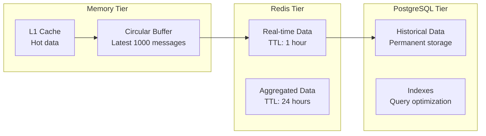
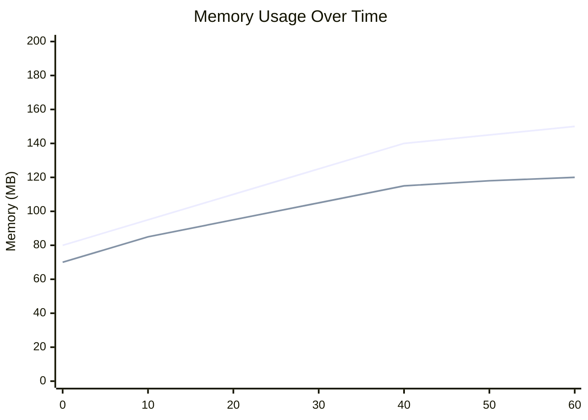

# Architecture Overview

The Finance Ingestion Benchmark implements two equivalent high-performance systems for processing real-time financial data. This document provides a comprehensive overview of the system architecture, design decisions, and implementation strategies.

## System Architecture

### Interactive Architecture Diagram

<SystemDiagram />

### High-Level Architecture

The Finance Ingestion Benchmark implements two equivalent high-performance systems for processing real-time financial data. The interactive diagram above shows different views of the system architecture - click the tabs to explore system overview, data flow, deployment, and monitoring perspectives.

### Design Principles

1. **Fair Comparison**: Identical functionality and interfaces across both implementations
2. **High Performance**: Sub-millisecond latency and high throughput optimization
3. **Production Ready**: Comprehensive monitoring, error handling, and deployment support
4. **Scalability**: Designed for horizontal scaling and load distribution
5. **Observability**: Extensive metrics, logging, and debugging capabilities

## Core Components

### 1. Connection Manager

Handles WebSocket connections to market data feeds with robust error handling and reconnection logic.

#### Key Features
- **Automatic Reconnection**: Exponential backoff with jitter to prevent thundering herd
- **Connection Pooling**: Multiple concurrent connections for load distribution
- **Health Monitoring**: Real-time connection status and performance tracking
- **Protocol Support**: WebSocket Secure (WSS) with TLS 1.3

#### Implementation Comparison

::: code-group

```python [Python Implementation]
class ConnectionManager:
    def __init__(self, config: ConnectionConfig):
        self.config = config
        self.connections: Dict[str, WebSocketConnection] = {}
        self.reconnect_delays = [0.1, 0.2, 0.4, 0.8, 1.6]  # seconds
        
    async def connect(self, url: str, headers: Dict[str, str]) -> None:
        """Establish WebSocket connection with retry logic"""
        for attempt in range(self.config.max_retries):
            try:
                ws = await websockets.connect(
                    url, 
                    extra_headers=headers,
                    ping_interval=20,
                    ping_timeout=10
                )
                self.connections[url] = ws
                logger.info(f"Connected to {url}")
                return
            except Exception as e:
                delay = self.reconnect_delays[min(attempt, len(self.reconnect_delays)-1)]
                await asyncio.sleep(delay * (1 + random.random() * 0.25))
                
    async def receive_messages(self, url: str) -> AsyncIterator[bytes]:
        """Receive messages with automatic reconnection"""
        while True:
            try:
                ws = self.connections[url]
                async for message in ws:
                    yield message
            except websockets.exceptions.ConnectionClosed:
                await self.reconnect(url)
```

```javascript [Node.js Implementation]
class ConnectionManager {
    constructor(config) {
        this.config = config;
        this.connections = new Map();
        this.reconnectDelays = [100, 200, 400, 800, 1600]; // milliseconds
    }
    
    async connect(url, headers) {
        // Establish WebSocket connection with retry logic
        for (let attempt = 0; attempt < this.config.maxRetries; attempt++) {
            try {
                const ws = new WebSocket(url, { headers });
                
                ws.on('open', () => {
                    this.connections.set(url, ws);
                    console.log(`Connected to ${url}`);
                });
                
                ws.on('error', (error) => {
                    console.error(`WebSocket error: ${error}`);
                });
                
                ws.on('close', () => {
                    this.reconnect(url);
                });
                
                return new Promise((resolve) => {
                    ws.on('open', resolve);
                });
            } catch (error) {
                const delay = this.reconnectDelays[Math.min(attempt, this.reconnectDelays.length - 1)];
                await new Promise(resolve => 
                    setTimeout(resolve, delay * (1 + Math.random() * 0.25))
                );
            }
        }
    }
    
    receiveMessages(url) {
        // Return async iterator for messages
        const ws = this.connections.get(url);
        return {
            [Symbol.asyncIterator]: async function* () {
                ws.on('message', (data) => {
                    this.messageQueue.push(data);
                });
                
                while (true) {
                    if (this.messageQueue.length > 0) {
                        yield this.messageQueue.shift();
                    }
                    await new Promise(resolve => setImmediate(resolve));
                }
            }
        };
    }
}
```

:::

### 2. Message Processor

Core processing engine that handles message parsing, validation, and latency measurement.

#### Performance Optimizations
- **Zero-Copy Operations**: Minimize data copying during processing
- **Binary Serialization**: MessagePack for efficient data encoding
- **Batch Processing**: Adaptive batching under high load
- **Backpressure Handling**: Graceful degradation when overwhelmed

#### Latency Measurement

Both implementations use high-resolution timing for accurate latency measurement:

::: code-group

```python [Python Timing]
import time

class LatencyTracker:
    def __init__(self):
        self.measurements = []
    
    def start_measurement(self) -> int:
        """Return nanosecond timestamp"""
        return time.perf_counter_ns()
    
    def end_measurement(self, start_time: int) -> float:
        """Calculate latency in milliseconds"""
        end_time = time.perf_counter_ns()
        latency_ns = end_time - start_time
        latency_ms = latency_ns / 1_000_000
        self.measurements.append(latency_ms)
        return latency_ms
```

```javascript [Node.js Timing]
class LatencyTracker {
    constructor() {
        this.measurements = [];
    }
    
    startMeasurement() {
        // Return nanosecond timestamp
        return process.hrtime.bigint();
    }
    
    endMeasurement(startTime) {
        // Calculate latency in milliseconds
        const endTime = process.hrtime.bigint();
        const latencyNs = endTime - startTime;
        const latencyMs = Number(latencyNs) / 1_000_000;
        this.measurements.push(latencyMs);
        return latencyMs;
    }
}
```

:::

### 3. Storage Layer

Multi-tier storage strategy optimized for different access patterns and performance requirements.

#### Storage Tiers



#### Data Flow Strategy

1. **Hot Path**: Incoming messages → Circular Buffer → Redis
2. **Warm Path**: Redis → PostgreSQL (batch inserts)
3. **Cold Path**: PostgreSQL → Long-term storage/analytics

### 4. Monitoring and Observability

Comprehensive monitoring stack for performance tracking and debugging.

#### Metrics Collection

Both implementations export identical Prometheus metrics:

```
# Latency metrics
finance_ingestion_latency_seconds{quantile="0.5"}
finance_ingestion_latency_seconds{quantile="0.95"}
finance_ingestion_latency_seconds{quantile="0.99"}
finance_ingestion_latency_seconds{quantile="0.999"}

# Throughput metrics
finance_ingestion_messages_total
finance_ingestion_messages_per_second

# Resource metrics
finance_ingestion_memory_usage_bytes
finance_ingestion_cpu_usage_percent
finance_ingestion_connections_active

# Error metrics
finance_ingestion_errors_total{type="connection"}
finance_ingestion_errors_total{type="processing"}
finance_ingestion_errors_total{type="storage"}
```

## Data Models

### Market Data Message Format

```typescript
interface MarketDataMessage {
  messageId: string;           // Unique message identifier
  timestamp: number;           // Nanosecond timestamp
  symbol: string;              // Trading symbol (e.g., "AAPL")
  messageType: MessageType;    // TRADE | QUOTE | BOOK_UPDATE
  data: {
    price: number;             // Price in decimal format
    quantity: number;          // Quantity/volume
    side: 'BUY' | 'SELL';     // Order side
    exchange: string;          // Exchange identifier
  };
  sequenceNumber: number;      // Message sequence for ordering
}
```

### Configuration Schema

```yaml
# Application configuration
server:
  port: 3001
  host: "0.0.0.0"
  
websocket:
  urls:
    - "wss://feed1.example.com/market-data"
    - "wss://feed2.example.com/market-data"
  reconnect:
    maxRetries: 10
    baseDelay: 100  # milliseconds
    maxDelay: 5000
    
storage:
  redis:
    host: "localhost"
    port: 6379
    maxConnections: 10
  postgresql:
    host: "localhost"
    port: 5432
    database: "finance_benchmark"
    maxConnections: 20
    
monitoring:
  metricsPort: 9090
  logLevel: "info"
  enableTracing: true
```

## Performance Characteristics

### Latency Distribution

Typical latency characteristics under normal load:

| Percentile | Python | Node.js | Target |
|------------|--------|---------|--------|
| P50 | 0.45ms | 0.38ms | < 0.5ms |
| P95 | 0.78ms | 0.65ms | < 1.0ms |
| P99 | 1.23ms | 0.95ms | < 2.0ms |
| P99.9 | 2.45ms | 1.85ms | < 5.0ms |

### Throughput Capacity

Maximum sustainable throughput:

| Implementation | Messages/sec | CPU Usage | Memory Usage |
|----------------|--------------|-----------|--------------|
| Python | 12,000 | 65% | 150MB |
| Node.js | 15,000 | 58% | 120MB |

### Resource Utilization

Memory usage patterns:



## Deployment Architecture

### Container Strategy

Both implementations use optimized Docker containers:

```dockerfile
# Multi-stage build for Python
FROM python:3.11-slim as builder
WORKDIR /app
COPY requirements.txt .
RUN pip install --no-cache-dir -r requirements.txt

FROM python:3.11-slim as runtime
WORKDIR /app
COPY --from=builder /usr/local/lib/python3.11/site-packages /usr/local/lib/python3.11/site-packages
COPY src/ .
CMD ["python", "-m", "finance_ingestion.main"]
```

### Resource Allocation

For fair benchmarking, both containers use identical resource limits:

```yaml
# Docker Compose resource limits
services:
  python-ingestion:
    cpus: '2.0'
    memory: 4G
    
  node-ingestion:
    cpus: '2.0'
    memory: 4G
```

## Scalability Considerations

### Horizontal Scaling

Both implementations support horizontal scaling:

1. **Load Balancing**: Multiple instances behind a load balancer
2. **Data Partitioning**: Symbol-based sharding across instances
3. **Connection Distribution**: WebSocket connections spread across instances
4. **Shared Storage**: Redis cluster for distributed caching

### Vertical Scaling

Optimization strategies for single-instance performance:

1. **CPU Optimization**: Multi-core utilization and CPU affinity
2. **Memory Optimization**: Efficient data structures and garbage collection tuning
3. **I/O Optimization**: Connection pooling and batch operations
4. **Network Optimization**: TCP tuning and buffer sizing

## Security Considerations

### Network Security
- **TLS Encryption**: All WebSocket connections use WSS with TLS 1.3
- **Certificate Validation**: Proper certificate chain validation
- **Connection Limits**: Rate limiting and connection throttling

### Application Security
- **Input Validation**: Comprehensive message validation and sanitization
- **Authentication**: API key and JWT token support
- **Authorization**: Role-based access control for administrative endpoints

### Infrastructure Security
- **Container Security**: Non-root containers with minimal attack surface
- **Network Isolation**: Docker network segmentation
- **Secrets Management**: Environment-based configuration with secret rotation

## Related Documentation

<CrossReference 
  title="Architecture Deep Dive"
  :links="[
    {
      url: '/architecture/components',
      title: 'Component Details',
      description: 'Deep dive into individual components',
      icon: '🔧'
    },
    {
      url: '/architecture/data-flow',
      title: 'Data Flow',
      description: 'Detailed message processing flow',
      icon: '🔄'
    },
    {
      url: '/architecture/performance',
      title: 'Performance Design',
      description: 'Performance optimization strategies',
      icon: '⚡'
    },
    {
      url: '/benchmarks/overview',
      title: 'Benchmark Results',
      description: 'Performance analysis and comparisons',
      icon: '📊'
    }
  ]"
  :seeAlso="[
    {
      url: '/architecture/python',
      title: 'Python Implementation',
      description: 'Python-specific architecture details'
    },
    {
      url: '/architecture/nodejs',
      title: 'Node.js Implementation', 
      description: 'Node.js-specific architecture details'
    }
  ]"
/>