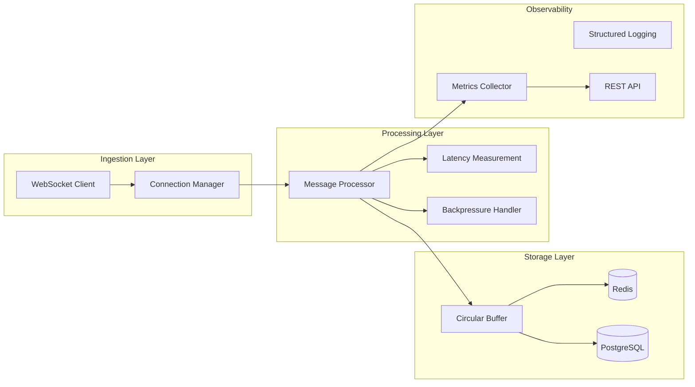

# Introduction

Welcome to the Finance Ingestion Benchmark project - a comprehensive comparison of high-performance financial data ingestion systems built in Python and Node.js.

## What is Finance Ingestion Benchmark?

This project provides two equivalent implementations of a real-time financial data processing system, designed to fairly compare the performance characteristics of Python and Node.js for high-frequency trading scenarios.

### Key Objectives

- **Performance Comparison**: Measure and compare latency, throughput, and resource utilization
- **Real-world Scenarios**: Test with realistic market data patterns and trading conditions  
- **Fair Benchmarking**: Ensure identical functionality and testing conditions across platforms
- **Production Readiness**: Provide deployment-ready systems with monitoring and observability

## Why Compare Python vs Node.js?

Both Python and Node.js are popular choices for financial technology applications, each with distinct advantages:

### Python Strengths
- **Rich Ecosystem**: Extensive libraries for financial analysis and data processing
- **Scientific Computing**: NumPy, Pandas integration for quantitative analysis
- **Async Performance**: Modern asyncio with uvloop for high-performance I/O
- **Developer Productivity**: Clear syntax and extensive tooling

### Node.js Strengths  
- **Event-Driven Architecture**: Natural fit for real-time data processing
- **Native Performance**: V8 engine optimization and native addon support
- **Concurrent Processing**: Built-in clustering and worker thread capabilities
- **JavaScript Ecosystem**: Unified language across frontend and backend

## Performance Targets

Our benchmark targets are based on industry standards for non-HFT (High-Frequency Trading) market data systems:

| Metric | Target | Industry Context |
|--------|--------|------------------|
| **Processing Latency** | < 1ms end-to-end | Standard for market data systems |
| **Throughput** | 10,000+ msg/sec | Moderate-to-high frequency scenarios |
| **Reconnection Time** | < 1 second | Market data feed expectations |
| **Memory Stability** | No leaks under load | Critical for 24/7 operation |

## System Architecture

Both implementations follow identical architectural patterns:



### Core Components

1. **WebSocket Connection Manager**
   - Handles real-time market data feeds
   - Implements reconnection logic with exponential backoff
   - Monitors connection health and statistics

2. **Message Processor**
   - High-performance message parsing and validation
   - End-to-end latency measurement
   - Backpressure handling for sustained load

3. **Storage Layer**
   - Redis for real-time data access (< 1ms lookup)
   - PostgreSQL for historical data persistence
   - In-memory circular buffers for high-frequency data

4. **Monitoring & Observability**
   - Prometheus metrics export
   - Structured JSON logging
   - REST API for health checks and statistics

## Technology Stack

### Python Implementation

```python
# Core dependencies
asyncio + uvloop          # High-performance event loop
websockets               # WebSocket client library
msgpack                  # Binary serialization
aioredis                 # Async Redis client
asyncpg                  # Async PostgreSQL client
prometheus_client        # Metrics export
structlog               # Structured logging
```

### Node.js Implementation

```javascript
// Core dependencies
cluster                  // Native multi-core utilization
ws                      // WebSocket client library
msgpack5                // Binary serialization
ioredis                 // Redis client with clustering
pg                      // PostgreSQL client
prom-client             // Prometheus metrics
winston                 // Structured logging
```

## Benchmarking Methodology

Our benchmarking approach ensures fair and accurate comparison:

### Test Scenarios

1. **Baseline Performance**: Single connection, moderate load
2. **High Throughput**: Multiple connections, maximum sustainable rate
3. **Burst Handling**: Market open simulation with traffic spikes
4. **Resource Efficiency**: Memory and CPU usage under various loads
5. **Stability Testing**: Long-running tests for memory leak detection

### Measurement Techniques

- **High-Resolution Timing**: Nanosecond precision for latency measurement
- **Statistical Analysis**: P50, P95, P99, P99.9 latency percentiles
- **Resource Monitoring**: Real-time CPU, memory, and network tracking
- **Identical Conditions**: Same hardware, network, and data patterns

### Data Generation

- **Realistic Patterns**: Based on actual market data characteristics
- **Configurable Load**: Adjustable message rates and burst patterns
- **Multiple Symbols**: Simulate real trading scenarios
- **Replay Capability**: Consistent test data for reproducible results

## Use Cases

This benchmark is valuable for:

### Technology Decision Making
- **Platform Selection**: Choose optimal technology for trading systems
- **Performance Planning**: Understand capacity and scaling requirements
- **Architecture Design**: Inform system design decisions

### Performance Engineering
- **Optimization Targets**: Identify bottlenecks and improvement opportunities
- **Resource Planning**: Understand hardware and infrastructure needs
- **Monitoring Setup**: Establish performance baselines and alerting thresholds

### Educational Purposes
- **Language Comparison**: Understand performance characteristics of different platforms
- **Best Practices**: Learn optimization techniques for real-time systems
- **System Design**: Study production-ready architecture patterns

## Getting Started

Ready to dive in? Here's what you'll need:

### Prerequisites
- **Node.js 18+** and npm 8+
- **Python 3.11+** with pip
- **Docker** and Docker Compose
- **Git** for version control

### Quick Setup
```bash
# Clone and setup
git clone <repository-url>
cd finance-ingestion-benchmark
npm install

# Start infrastructure
npm run docker:up

# Run development servers
npm run dev
```

### Next Steps
1. [Installation Guide](/guide/installation) - Detailed setup instructions
2. [Getting Started](/guide/getting-started) - Your first benchmark run
3. [Architecture Overview](/architecture/overview) - Deep dive into system design
4. [Benchmark Results](/benchmarks/overview) - Performance analysis and results

## Community and Support

- **GitHub Repository**: [finance-ingestion-benchmark](https://github.com/finance-ingestion-benchmark)
- **Issues and Discussions**: Use GitHub Issues for questions and bug reports
- **Contributing**: See our [Contributing Guide](/contributing) for development guidelines
- **License**: MIT License - see LICENSE file for details