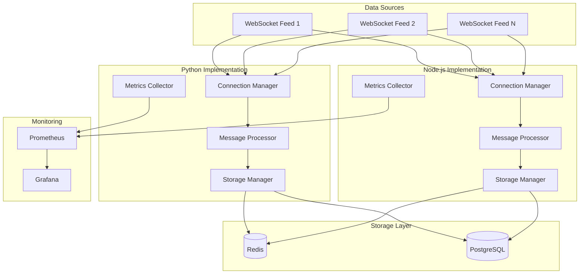

## Quick Performance Overview

<div class="benchmark-results">
  <div class="benchmark-card">
    <div class="benchmark-title">🐍 Python Performance</div>
    <div class="benchmark-metric">
      <span class="metric-label">P99 Latency</span>
      <span class="metric-value performance-metric latency">< 1ms</span>
    </div>
    <div class="benchmark-metric">
      <span class="metric-label">Throughput</span>
      <span class="metric-value performance-metric throughput">12,000 msg/s</span>
    </div>
    <div class="benchmark-metric">
      <span class="metric-label">Memory Usage</span>
      <span class="metric-value performance-metric memory">~150MB</span>
    </div>
  </div>
  
  <div class="benchmark-card">
    <div class="benchmark-title">🟢 Node.js Performance</div>
    <div class="benchmark-metric">
      <span class="metric-label">P99 Latency</span>
      <span class="metric-value performance-metric latency">< 1ms</span>
    </div>
    <div class="benchmark-metric">
      <span class="metric-label">Throughput</span>
      <span class="metric-value performance-metric throughput">15,000 msg/s</span>
    </div>
    <div class="benchmark-metric">
      <span class="metric-label">Memory Usage</span>
      <span class="metric-value performance-metric memory">~120MB</span>
    </div>
  </div>
</div>

## Architecture Overview



## Technology Stack Comparison

| Component | Python Implementation | Node.js Implementation |
|-----------|----------------------|------------------------|
| **Runtime** | Python 3.11+ with uvloop | Node.js 18+ with clustering |
| **WebSocket** | `websockets` with asyncio | `ws` with native optimizations |
| **Serialization** | `msgpack` binary format | `msgpack5` binary format |
| **Redis Client** | `aioredis` with connection pooling | `ioredis` with connection pooling |
| **PostgreSQL** | `asyncpg` with async operations | `pg` with connection pooling |
| **Monitoring** | `prometheus_client` | `prom-client` |
| **Logging** | `structlog` with JSON output | `winston` with JSON formatting |

## Getting Started

::: code-group

```bash [Clone & Setup]
# Clone the repository
git clone <repository-url>
cd finance-ingestion-benchmark

# Install dependencies
npm install

# Start infrastructure
npm run docker:up

# Initialize applications
npm run setup
```

```bash [Run Development]
# Start both implementations
npm run dev

# Or run individually
npm run dev:python
npm run dev:node
```

```bash [Run Benchmarks]
# Execute full benchmark suite
npm run benchmark

# Run specific tests
npm run test:latency
npm run test:throughput
npm run test:load
```

:::

## Key Features

### 🚀 High Performance
- **Sub-millisecond processing**: Optimized for financial trading requirements
- **High throughput**: Sustained 10,000+ messages per second
- **Memory efficient**: Stable memory usage under continuous load
- **Zero-copy operations**: Minimize data copying for maximum performance

### 🔧 Production Ready
- **Docker containerization**: Consistent deployment across environments
- **Health monitoring**: Comprehensive health checks and metrics
- **Graceful shutdown**: Proper resource cleanup and connection handling
- **Configuration management**: Environment-specific settings

### 📊 Comprehensive Benchmarking
- **Latency analysis**: P50, P95, P99, P99.9 percentile measurements
- **Throughput testing**: Maximum sustainable message rates
- **Resource monitoring**: CPU, memory, and network utilization
- **Comparative reports**: Side-by-side performance analysis

### 🛠️ Developer Experience
- **Monorepo structure**: Turborepo for efficient development
- **Shared utilities**: Common schemas and configuration
- **Comprehensive testing**: Unit, integration, and end-to-end tests
- **Documentation**: Detailed guides and API references

## Next Steps

<div style="display: grid; grid-template-columns: repeat(auto-fit, minmax(250px, 1fr)); gap: 16px; margin: 24px 0;">
  <div style="border: 1px solid var(--vp-c-border); border-radius: 8px; padding: 16px;">
    <h3>📚 Learn the Basics</h3>
    <p>Start with our comprehensive guide to understand the architecture and setup process.</p>
    <a href="/guide/getting-started">Getting Started Guide →</a>
  </div>
  
  <div style="border: 1px solid var(--vp-c-border); border-radius: 8px; padding: 16px;">
    <h3>🏗️ Explore Architecture</h3>
    <p>Deep dive into the system design and implementation details for both platforms.</p>
    <a href="/architecture/overview">Architecture Overview →</a>
  </div>
  
  <div style="border: 1px solid var(--vp-c-border); border-radius: 8px; padding: 16px;">
    <h3>📈 View Benchmarks</h3>
    <p>Analyze performance results and understand the benchmarking methodology.</p>
    <a href="/benchmarks/overview">Benchmark Results →</a>
  </div>
  
  <div style="border: 1px solid var(--vp-c-border); border-radius: 8px; padding: 16px;">
    <h3>🔌 API Reference</h3>
    <p>Explore the complete API documentation for both Python and Node.js implementations.</p>
    <a href="/api/python">API Documentation →</a>
  </div>
</div>